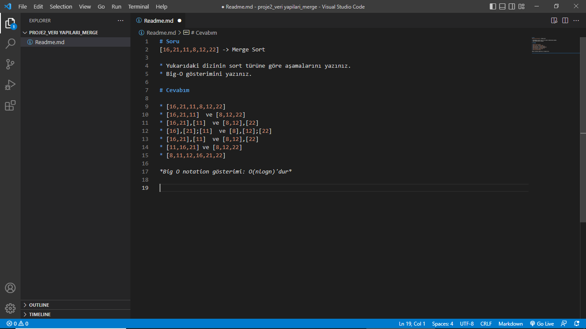

# Soru
[16,21,11,8,12,22] -> Merge Sort

* Yukarıdaki dizinin sort türüne göre aşamalarını yazınız.
* Big-O gösterimini yazınız.

# Cevabım

* [16,21,11,8,12,22]
* [16,21,11]  ve [8,12,22] 
* [16,21],[11]  ve [8,12],[22]  
* [16],[21];[11]  ve [8],[12];[22]
* [16,21],[11]  ve [8,12],[22]  
* [11,16,21] ve [8,12,22]
* [8,11,12,16,21,22]

*Big O notation gösterimi: O(nlogn)'dur*

[Patika Linki](patika.dev)